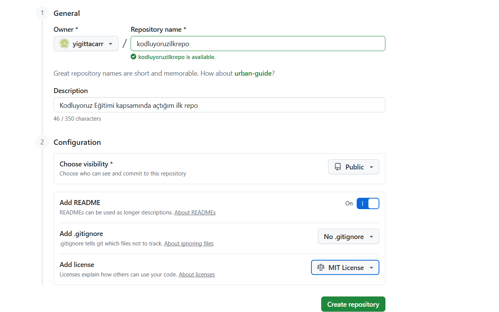

### Kodluyoruz Ilk Repo

bu repo [Kodluyoruz]() Front-End Eğitiminde oluşturduğumuz ilk repo, İçerisinde bir adet README dosyası , bir adet de index.html bulunuyor.




## Installation

Projeyi clonlamak  için ;


```
git clone https://github.com/yigittacarr/kodluyoruzilkrepo.git

```

## Usage

projeyi klonladıktan sonra ;

linux için:

```
    cd kodluyoruzilkrepo
    code .

```

## Contributing

pull requestler kabul edilir.


## Lisance

[MIT]()